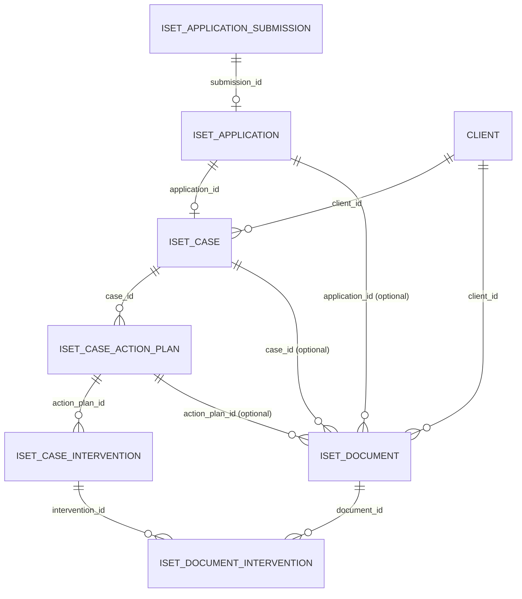

# Database Overview (Shared MySQL)

Purpose: Quick map for Codex and developers. Use this for first-pass answers, then verify against the schema dump or migrations.

## Orientation
- Admin dashboard and public portal share the `iset_intake` MySQL schema.
- Migrations and schema changes live in `db/migrations/` (admin dashboard). Ad-hoc DDL lives in `sql/`.
- Dev DB runs on the Windows host. From WSL, use the Windows MySQL client as described in `docs/AGENTS.md`.

## Logical relationships (from current docs)

Notes:
- Relationships are logical and sourced from docs; verify enforcement and required columns in the schema dump.
- `iset_document.client_id` is required; application/case/action plan links are optional and context-driven.

## Domain table map (not exhaustive)
- Intake submissions and applications: `iset_application_submission`, `iset_application`, `iset_application_version`, `iset_application_draft`, `iset_application_draft_dynamic`.
- Cases and assessments: `iset_case`, `iset_case_assessment`, `iset_case_action_plan`, `iset_case_intervention`, `iset_case_financial_snapshot`, `iset_case_event`, `iset_case_note`, `iset_case_task`, `iset_case_watch`, `iset_case_action_item`, `iset_case_compliance_check`, `iset_case_reminder`.
- Clients and orgs: `client`, `organization`, `ptma`, `staff_profiles`, `staff_region`, `user`.
- Documents and uploads: `iset_document`, `iset_document_intervention`, `iset_application_file`, `pending_uploads`, `document_type`, `payment_packet_document`, `message_attachment`.
- Messaging: `messages`, `message_attachment`, `message_signing_request`, `signing_request`, `staff_message`, `staff_message_item`, `staff_message_thread`, `staff_message_thread_participant`.
- Finance and payments: `payment_packet`, `payment_packet_line`, `payment_batch`, `payment_batch_line`, `payment_line_transaction`, `payment_status_event`, `payee_profile`, `finance_transaction`, `finance_saved_view`, `budget_*`, `funding_stream`, `payment_override`, `payment_packet_communication`.
- Workflow authoring: `workflow`, `workflow_step`, `workflow_route`, `workflow_route_option`, `step`, `step_component`, `component`, `component_template`, `component_template_backup`, `blockstep`.
- Runtime/config/audit: `iset_runtime_config`, `system_config`, `system_config_audit`, `__migrations`, `schema_migrations`, `iset_migration`.
- Notifications: `iset_internal_notification`, `iset_internal_notification_dismissal`, `notification_setting`, `notification_template`.
- ESDC/ILMP: `esdc_participant_submission`, `esdc_participant_submission_history`, `esdc_reporting_package`, `esdc_reporting_note`, `esdc_intervention_code`, `esdc_intervention_outcome`, `noc_code`, `noc_version`.

## Demo data guidance (common Q&A)
- Prefer API flows (intake submit, admin create actions) to avoid missing derived rows and audit events.
- When manually seeding demo data, confirm required columns in `docs/data/DB-Structure-Dump/` and then follow a dependency order like this (typical for application + client + intervention demos):
1. Identity and routing: `user` (applicant), `client`, optional `organization` or `ptma` if routing or scoping is needed.
2. Submission and application: `iset_application_submission` (immutable snapshot) then `iset_application` (working copy tied to submission).
3. Case: `iset_case` (link to `application_id` and `client_id`), plus `iset_case_event` for timeline visibility if needed.
4. Assessment: `iset_case_assessment` if the workspace expects assessment payloads.
5. Plans and interventions: `iset_case_action_plan` then `iset_case_intervention` (link to case + plan). Reference lookup tables (`funding_stream`, `esdc_intervention_code`, `esdc_intervention_outcome`, `noc_code`, `noc_version`) when the UI requires those fields.
6. Documents: `iset_document` (client_id required) plus `iset_document_intervention` for intervention links; use `payment_packet_document` for payment evidence.

If a future question asks "which tables should I populate?", start from the relevant domain doc and cross-check the schema dump for required columns and constraints.

## Schema lookup shortcuts (dev)
```sh
# From WSL (Windows MySQL client)
"/mnt/c/Program Files/MySQL/MySQL Server 8.0/bin/mysql.exe" -u root -p"<from .env>" -D iset_intake -e "SHOW CREATE TABLE iset_case\\G"

# Schema dump files (no data)
ls docs/data/DB-Structure-Dump
```
