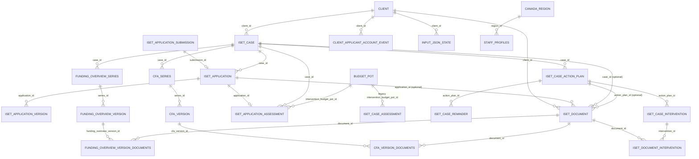

# Database Overview (Shared MySQL)

Purpose: Quick map for Codex and developers. Use this for first-pass answers, then verify against the schema dump or migrations.

## Orientation
- Admin dashboard and public portal share the `iset_intake` MySQL schema.
- Canonical shared-schema migrations now live in `admin-dashboard/sql/migrations/` and are tracked in `iset_migration`; see `docs/ops/migration-runner.md`.
- `admin-dashboard/sql/ops/` is for one-off/manual SQL and is not auto-applied by the server.
- Deployed admin environments now force `DISABLE_AUTO_MIGRATIONS=true`, so TEST/PROD schema changes should come through the explicit deploy/migration commands rather than app startup.
- `admin-dashboard/db/migrations/` is a legacy archive/reference path, not the live canonical runner.
- `../ISET-intake/db/migrations/` is currently empty and should stay inactive for PATH shared-schema work.
- Deployed portal environments now force `AUTO_MIGRATE=false`, so the public portal should not mutate the shared schema in test/prod.
- `../ISET-intake/scripts/run-migrations.js` still exists as a legacy/manual helper and writes to `schema_migrations`; do not use it as the normal PATH deployment path.
- Dev DB runs on the Windows host. From WSL, use the Windows MySQL client as described in `docs/AGENTS.md`.

## Logical relationships (from current docs)

Notes:
- Relationships are logical and sourced from docs; verify enforcement and required columns in the schema dump.
- `iset_document.client_id` is required by current source-specific constraints for application submissions, manual uploads, secure-message attachments, and system-generated documents. Manual uploads and system-generated documents also require a real `case_id`; application-linked rows keep both `application_id` and the owning `case_id`, and must carry `applicant_user_id`.
- Secure messages are case-scoped typed-actor records. New message/document work should preserve the constraints documented in `docs/data/integrations/secure-messaging.md`.
- Shared event actors and read receipts now use typed references: `iset_event_entry.actor_staff_profile_id` / `actor_applicant_user_id` and `iset_event_receipt.viewer_staff_profile_id` / `viewer_applicant_user_id`. Legacy `iset_event_entry.actor_id` remains opaque audit text and staff/applicant events are CHECK-hardened to typed refs; legacy event receipt `recipient_id` is retired in DEV.
- DEV physically retired `iset_case.application_id`; derive case application context from `iset_application.case_id`. `iset_application.client_id` and `iset_application.case_id` are required in DEV.
- DEV physically retired `iset_application_version.created_by_id`; derive version author display from `created_by_staff_profile_id` / `created_by_user_id`.
- DEV constrains application submission/version lineage and CFA case/version/document/participant relationships. CFA agreement documents must resolve to the same case/client as their CFA series. Funding Overview signature versions follow the same case-scoped series pattern through `funding_overview_series`, `funding_overview_version`, and `funding_overview_version_documents`; signed versions are immutable history and unsigned prior sends are withdrawn when a new Funding Overview is sent.
- DEV constrains the remaining deterministic relationship gaps for `client_applicant_account_event.client_id`, `input_json_state.client_id`, `iset_case_assessment.intervention_budget_pot_id`, `iset_case_reminder.action_plan_id`, and `staff_profiles.region_id`. Workflow `workflow_id` fields remain string runtime keys such as `iset-v1`, not numeric `workflow.id` FKs.
- DEV now has additive application-scoped assessment table `iset_application_assessment` for the Option B repeat-application containment fix. Application-backed assessment workflows should resolve by selected `application_id` first and must not blindly fall back to `iset_case_assessment` by `case_id`. `iset_case_assessment` remains legacy case-scoped compatibility for imported/application-less or not-yet-migrated case behavior. See `docs/planning/application-assessment-application-scope-migration-plan.md`.
- DEV retired the empty `zzz_legacy_documents` experiment table. Do not use it as a fallback document source; all supporting-document work should go through `iset_document` plus the scoped attachment/document relationships above.
- Finance allocation evidence object keys are not standalone access authority. Allocation evidence presign/delete must prove the key is referenced by `budget_allocation`/`budget_pot` evidence metadata or is an unexpired `pending_uploads` row owned by the current local staff user with `document_type = finance_allocation_evidence`.

## Domain table map (not exhaustive)
- Intake submissions and applications: `iset_application_submission`, `iset_application`, `iset_application_version`, `iset_application_draft`, `iset_application_draft_dynamic`.
- Cases and assessments: `iset_case`, `iset_application_assessment`, `iset_case_assessment` (legacy case-scoped compatibility), `iset_case_action_plan`, `iset_case_intervention`, `iset_case_financial_snapshot`, `iset_case_event`, `iset_case_note`, `iset_case_task`, `iset_case_watch`, `iset_case_action_item`, `iset_case_compliance_check`, `iset_case_reminder`.
- Clients and orgs: `client`, `organization`, `ptma`, `staff_profiles`, `staff_region`, `user`.
- Documents and uploads: `iset_document`, `iset_document_intervention`, `iset_application_file`, `pending_uploads`, `document_type`, `payment_packet_document`, `message_attachment`, `funding_overview_series`, `funding_overview_version`, `funding_overview_version_documents`.
- Messaging: `messages`, `message_attachment`, `message_signing_request`, `signing_request`, `staff_message`, `staff_message_item`, `staff_message_thread`, `staff_message_thread_participant`.
- Hands-on tutorials: `staff_tutorial_progress`.
- Finance and payments: `payment_packet`, `payment_packet_line`, `payment_followup_event`, `payment_batch`, `payment_batch_line`, `payment_line_transaction`, `payment_status_event`, `payee_profile`, `finance_transaction`, `finance_saved_view`, `budget_*`, `funding_stream`, `payment_override`, `payment_packet_communication`.
- Workflow authoring: `workflow`, `workflow_step`, `workflow_route`, `workflow_route_option`, `step`, `step_component`, `component`, `component_template`, `component_template_backup`, `blockstep`.
- Events/runtime/config/audit: `iset_event_entry`, `iset_event_receipt`, `iset_runtime_config`, `system_config`, `system_config_audit`, `__migrations`, `schema_migrations`, `iset_migration`. The unfinished `iset_event_outbox` table was retired by migration `20260510_0001_retire_event_outbox.sql`.
- Notifications: `iset_internal_notification`, `iset_internal_notification_dismissal`, `notification_setting`, `notification_template`. Direct bell-alert audiences/viewers are typed as staff-profile or applicant-user subjects; legacy `audience_user_id` / dismissal `user_id` columns are retired in DEV.
- ESDC/ILMP: `esdc_participant_submission`, `esdc_participant_submission_history`, `esdc_reporting_package`, `esdc_reporting_note`, `esdc_intervention_code`, `esdc_intervention_outcome`, `noc_code`, `noc_version`.

## Demo data guidance (common Q&A)
- Prefer API flows (intake submit, admin create actions) to avoid missing derived rows and audit events.
- When manually seeding demo data, confirm required columns in `docs/data/DB-Structure-Dump/` and then follow a dependency order like this (typical for application + client + intervention demos):
1. Identity and routing: `user` (applicant), `client`, optional `organization` or `ptma` if routing or scoping is needed.
2. Submission: `iset_application_submission` (immutable snapshot).
3. Case and application: create or resolve `iset_case` (linked to `client_id`), then insert `iset_application` with both `client_id` and `case_id`, plus `iset_case_event` for timeline visibility if needed.
4. Assessment: `iset_application_assessment` for application-backed assessment workflows; use `iset_case_assessment` only for legacy/imported application-less compatibility where that workflow is explicitly supported.
5. Plans and interventions: `iset_case_action_plan` then `iset_case_intervention` (link to case + plan). Reference lookup tables (`funding_stream`, `esdc_intervention_code`, `esdc_intervention_outcome`, `noc_code`, `noc_version`) when the UI requires those fields.
6. Documents: `iset_document` (client_id required) plus `iset_document_intervention` for intervention links; use `payment_packet_document` for payment evidence.

If a future question asks "which tables should I populate?", start from the relevant domain doc and cross-check the schema dump for required columns and constraints.

For client-file imports that are not meant to recreate historical applications, the target sequence is different: `client` -> `iset_case` -> `case_context_json`, with assessment/action-plan/intervention rows created later only if the real workflow reaches those stages. Core case creation, case updates, and case listing now support that model; remaining caveats are mostly around participant-account-dependent features like secure messaging and applicant-scoped documents. See `docs/guides/client-file-imports.md` before designing import tooling.

## Schema lookup shortcuts (dev)
```sh
# From WSL (Windows MySQL client)
"/mnt/c/Program Files/MySQL/MySQL Server 8.0/bin/mysql.exe" -u root -p"<from .env>" -D iset_intake -e "SHOW CREATE TABLE iset_case\\G"

# Schema dump files (no data)
ls docs/data/DB-Structure-Dump
```
